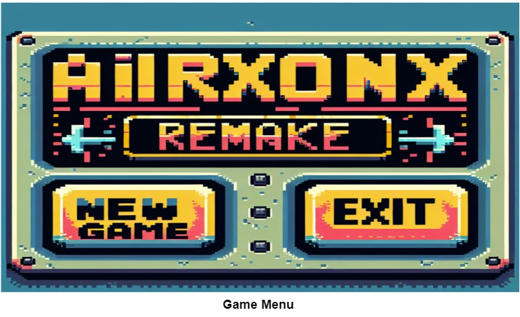
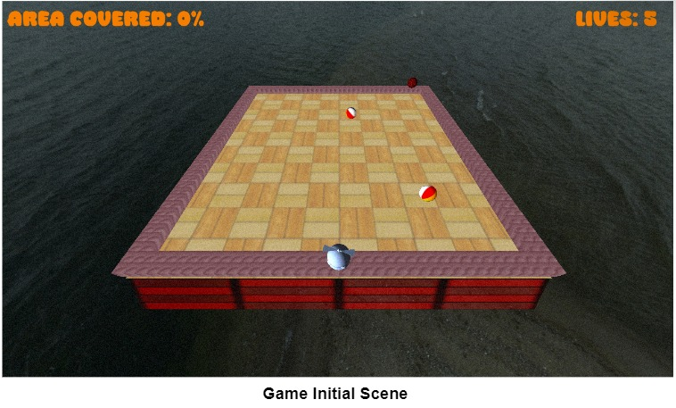
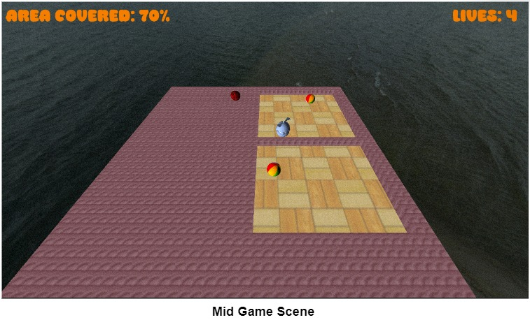

# AirXoniX Remake

Welcome to the AirXoniX Remake repository. This project is developed using C++ and OpenGL, following Object-Oriented Programming principles and various data structures and algorithms.

## Table of Contents
- [Game Overview](#game-overview)
- [Setup](#setup)
- [Development Features](#development-features)
- [Controls](#controls)
- [Screenshots](#screenshots)
- [Contributing](#contributing)
- [License](#license)

## Game Overview
AirXoniX is a modernized version of the classic game XoniX. The objective is to capture as much area as possible by moving the player character around the screen while avoiding obstacles and enemies.

## Setup
To compile and run the game, you need to have the following dependencies installed:
- C++17 or later
- OpenGL
- GLFW
- GLEW
- FMOD (for sound)

Clone the repository and run the following commands:

```bash
mkdir build
cd build
cmake ..
make
./AirXoniX
```

# Development Features

- **Mesh:** Basic shapes and models.
- **Transform:** Handling object positions, rotations, and scaling.
- **Pipeline State:** Configuring the graphics pipeline.
- **Forward Renderer:** Rendering objects directly to the screen.
- **Sky Rendering:** Rendering the skybox or background.
- **Keyboard Movement:** Implementing player movement using keyboard input.
- **Collision Logic:** Detecting and handling collisions.
- **Gameplay Loop:** Main game loop managing game states and updates.
- **Sound Design:** Adding sound effects and background music.
- **Shaders:** Creating and managing shader programs.
- **Entities:** Handling game objects and their behaviors.
- **Post-Processing:** Applying effects after rendering.
- **Area Coverage Logic:** Tracking and displaying covered areas.
- **Film Grain Effect:** Adding film grain for visual effect.
- **Game Menu:** Creating a menu for game navigation.
- **Texture:** Managing textures for game objects.
- **Sampler:** Handling texture sampling.
- **Material:** Defining materials for rendering.
- **Components:** Modular components for game entities.
- **Light:** Implementing lighting effects.

# Controls

- **WASD keys:** Move player
- **Space:** Start/Stop action
- **Esc:** Open menu

# Screenshots

- **Menu**
   </a>
- **Game Initial Scene**
   </a>
- **Game Mid Scene**
   </a>

# Contributing

Contributions are welcome! Please read the contributing guidelines first.

# License

This project is licensed under the MIT License - see the LICENSE file for details.

